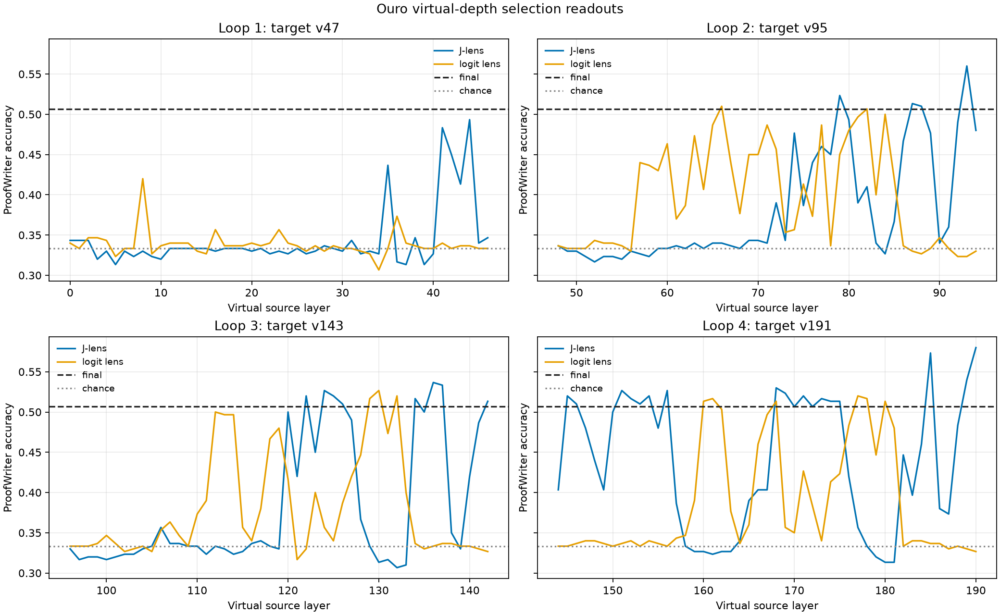
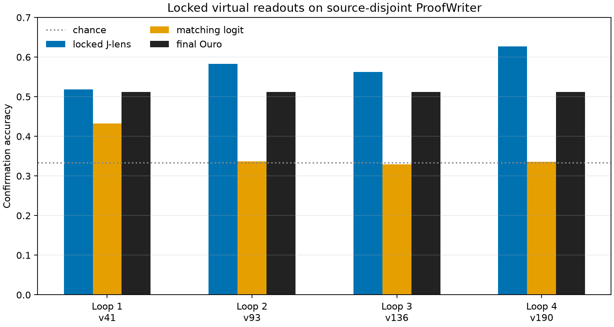

# Reading Looped Transformers with Virtual-Depth Jacobian Lenses

**Standalone research report · 2026-09-07**

## Abstract

Ordinary Transformer interpretability indexes computation by untied layer. Ouro-2.6B-Thinking instead applies the same 48-block decoder repeatedly for four recurrent passes. We therefore expose a virtual depth of 192 computation stages and fit target-specific Jacobian lenses at each loop boundary, using only the preceding 47 virtual stages for transport. This report compares those readouts with matched logit lenses on balanced ProofWriter.

The experiment follows the loop-specific methodology of Wang and Reid's virtual-unrolling study: recurrent blocks are addressable by `(pass, shared block)`, transport is measured within local recurrence windows, and selection layers are locked before source-disjoint confirmation. The present work is a narrower replication/extension: it evaluates a logical-label readout and does not yet include the full causal workspace suite.

## Contents

1. [Why loops differ from ordinary Transformers](#why-loops-differ-from-ordinary-transformers)
2. [Protocol and best-practice controls](#protocol-and-best-practice-controls)
3. [Selection readouts](#selection-readouts)
   1. [Figure: selection readouts](#figure-selection-readouts)
4. [Locked confirmation](#locked-confirmation)
   1. [Figure: confirmation results](#figure-confirmation-results)
5. [Interpretation and limitations](#interpretation-and-limitations)
6. [Relation to established work](#relation-to-established-work)

## Why loops differ from ordinary Transformers

In a conventional Transformer, layer 20 and layer 40 have different parameters and form a single feed-forward depth axis. In Ouro, block 20 in pass 1 and block 20 in pass 3 share parameters but receive different hidden states and recurrent context. A useful coordinate is therefore `v = 48 × pass + block`.

This changes interpretability in four ways:

- A single final-target lens can lose information crossing loop boundaries.
- The same shared block can have different functional roles at different recurrent passes.
- Readable content may be reconstructed independently on each loop rather than carried forward.
- An intervention may need to persist through later loops to remain behaviorally effective.

The model's four loop-end checkpoints are `v47`, `v95`, `v143`, and `v191`; these are not equivalent to four ordinary untied layers.

## Protocol and best-practice controls

- Model: local BF16 `ByteDance/Ouro-2.6B-Thinking`, 48 shared blocks, four recurrent passes.
- Lens fit: eight generic prompts, sequence length 64, eight leading positions skipped, dimension batch 16.
- Lens family: one target at each loop end; each target uses the immediately preceding 47 virtual layers as sources.
- Baseline: ordinary logit lens evaluated at exactly the same source virtual layers.
- Task: balanced three-way ProofWriter (`True`, `False`, `Unknown`).
- Selection: 300 items, used only to choose the source layer within each loop.
- Confirmation: 1,500 source-disjoint items, with the selected layer locked in advance.

This prevents the main loop-specific failure mode: selecting a layer after looking at the confirmation set, or treating a cross-loop final-target map as evidence that information persists across recurrence.

## Selection readouts

| Loop | Best J-lens source | J-lens | Best logit source | Logit lens | Final Ouro |
|---:|---:|---:|---:|---:|---:|
| 1 | v44 | 49.3% | v8 | 42.0% | 50.7% |
| 2 | v93 | 56.0% | v66 | 51.0% | 50.7% |
| 3 | v136 | 53.7% | v130 | 52.7% | 50.7% |
| 4 | v190 | 58.0% | v177 | 52.0% | 50.7% |

### Figure: selection readouts

## Locked confirmation

| Loop | Locked J-lens source | J-lens | Best logit source | Logit lens | Final Ouro |
|---:|---:|---:|---:|---:|---:|
| 1 | v41 | 51.9% | v8 | 43.3% | 51.2% |
| 2 | v93 | 58.3% | v93 | 33.7% | 51.2% |
| 3 | v136 | 56.2% | v136 | 32.9% | 51.2% |
| 4 | v190 | 62.7% | v190 | 33.5% | 51.2% |

### Figure: confirmation results

## Interpretation and limitations

The first confirmed results should be read as a recurrent-depth profile, not as a universal J-lens advantage. Loop 1's selected layer did not beat the final model on confirmation, while the selected layers for later loops currently show stronger readouts. This makes recurrence position part of the hypothesis, rather than a nuisance dimension.

The evaluation remains a three-way observational label readout. It does not establish that the model internally uses the decoded representation, nor that a causal intervention would improve reasoning. The next causal tests should patch or ablate multi-direction subspaces across all remaining loops and compare maintained versus single-step interventions.

The fit is also intentionally modest: eight generic prompts rather than the 1,000-prompt reference-scale lens protocol. Results are therefore a local research pilot until replicated with a larger fit corpus and additional task families.

## Relation to established work

The closest precedent is [Looped Transformers under the Jacobian Lens](https://arxiv.org/abs/2609.01924), which introduced virtual unrolling for Ouro and Huginn and combined lens readouts with transport, workspace, and causal intervention analyses. [Operational Proto-Introspection in Looped Language Models](https://arxiv.org/abs/2607.18553) probes Ouro trajectories for process quality and branch viability, while [Step-resolved data attribution for looped transformers](https://arxiv.org/abs/2602.10097) decomposes influence by recurrent step. [Loop, Think, & Generalize](https://arxiv.org/abs/2604.07822) provides mechanistic analysis on smaller recurrent-depth models trained on synthetic compositional tasks.

Our contribution here is narrower: an independently implemented virtual-depth adapter, loop-end J-lens family, and balanced ProofWriter readout/confirmation track. It should be presented as complementary replication and task-focused evaluation, not as the first interpretability method for loop transformers.
